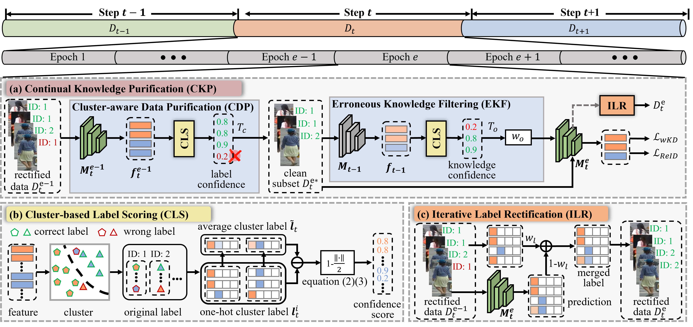
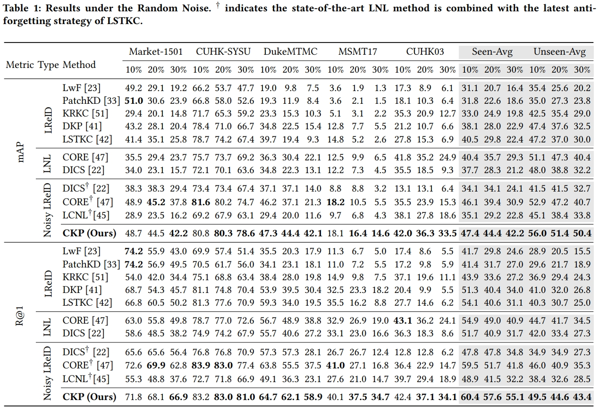

# [ACM MM2024] Mitigate Catastrophic Remembering via Continual Knowledge Purification for Noisy Lifelong Person Re-Identification (CKP)
The *official* repository for  [Mitigate Catastrophic Remembering via Continual Knowledge Purification for Noisy Lifelong Person Re-Identification](https://openreview.net/pdf?id=ROsHwGMYeJ).



## Installation
```shell
conda create -n IRL python=3.7
conda activate IRL
pip install torch==1.13.1+cu117 torchvision==0.14.1+cu117 torchaudio==0.13.1 --extra-index-url https://download.pytorch.org/whl/cu117
pip install -r requirement.txt
```
## Prepare Datasets
Download the person re-identification datasets [Market-1501](https://drive.google.com/file/d/0B8-rUzbwVRk0c054eEozWG9COHM/view), [MSMT17](http://www.pkuvmc.com/dataset.html), [CUHK03](https://github.com/zhunzhong07/person-re-ranking/tree/master/evaluation/data/CUHK03), [SenseReID](https://drive.google.com/file/d/0B56OfSrVI8hubVJLTzkwV2VaOWM/view?resourcekey=0-PKtdd5m_Jatmi2n9Kb_gFQ). Other datasets can be prepared following [Torchreid_Datasets_Doc](https://kaiyangzhou.github.io/deep-person-reid/datasets.html) and [light-reid](https://github.com/wangguanan/light-reid).
Then unzip them and rename them under the directory like

```
PRID
├── CUHK01
│   └──..
├── CUHK02
│   └──..
├── CUHK03
│   └──..
├── CUHK-SYSU
│   └──..
├── DukeMTMC-reID
│   └──..
├── grid
│   └──..
├── i-LIDS_Pedestrain
│   └──..
├── MSMT17_V2
│   └──..
├── Market-1501
│   └──..
├── prid2011
│   └──..
├── SenseReID
│   └──..
└── viper
    └──..
```

 This repository includes noisy label configurations, located in the `noisy_data/` folder. Along with the noisy ratios of 0.1, 0.2, and 0.3 used in the paper, we also provide additional ratios of 0.4, 0.5, 0.6, 0.7, and 0.8 to support further investigation for the Noisy LReID community.  Note that the noisy data are generated following [PNet](https://github.com/mangye16/ReID-Label-Noise).

## Quick Start

Training on a single dataset (--noise random/pattern/clean, --noise_ratio 0.1/0.2/0.3/0.4/...):
```shell
`python continual_train_noisy.py --data-dir path/to/PRID --noise_ratio XX --noise YY`
(for example, `python continual_train_noisy.py --data-dir ../DATA/PRID --noise_ratio 0.3 --noise pattern`)
```

Reproduce the random/pattern noise results by running the bash file:

```shell
`sh release_random.sh`
`sh release_pattern.sh`
```

Evaluation from checkpoint:

```shell
`python continual_train_noisy.py --data-dir path/to/PRID --test_folder /path/to/pretrained/folder`
```

## Results
The following results were obtained with a NVIDIA 4090 GPU.




## Citation
If you find this code useful for your research, please cite our paper.
@inproceedings{xu2024mitigate,
  title={Mitigate Catastrophic Remembering via Continual Knowledge Purification for Noisy Lifelong Person Re-Identification},
  author={Xu, Kunlun and Zhang, Haozhuo and Li, Yu and Peng, Yuxin and Zhou, Jiahuan},
  booktitle={ACM Multimedia 2024}
}


## Acknowledgement
Our LReID code is based on [LSTKC](https://github.com/zhoujiahuan1991/AAAI2024-LSTKC) and [CORE](https://github.com/mangye16/ReID-Label-Noise).

## Contact

For any questions, feel free to contact us (xkl@stu.pku.edu.cn).

Welcome to our [Laboratory Homepage](http://www.icst.pku.edu.cn/mipl/home/) and [OV<sup>3</sup> Lab](https://zhoujiahuan1991.github.io/) for more information about our papers, source codes, and datasets.

